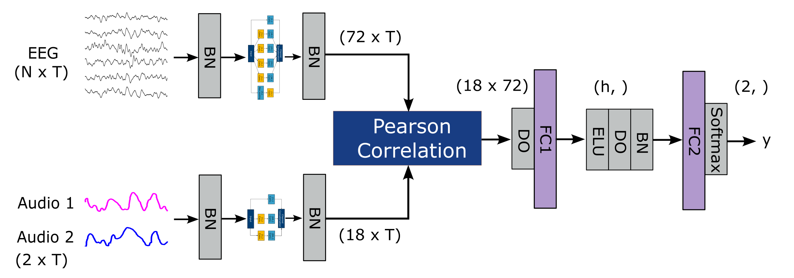

# AADNet: An End-to-End Deep Learning Model for Auditory Attention
This is source code for AADNet described in the study __AADNet: An End-to-End Deep Learning Model for Auditory Attention.__ This also includes the implementation of the other baseline methods of AAD algorithms used in this study, including the linear stimulus reconstruction (LSR), Canonical Correlation Analysis (CCA), and the non-linear stimulus reconstruction (NSR) methods. It is important to note that the implementation of NSR method from [Thornton et al.](https://iopscience.iop.org/article/10.1088/1741-2552/ac7976) (the EEGNetAAD model in _aadnet/EnvelopeAAD.py_ file) is integrated from [the original implementation](https://github.com/Mike-boop/mldecoders) (main branch, commit 09ad839f5 made by July, 19th, 2022). Please note that the implementation of this study is not optimized for memory usage. Readers are welcome to re-implement all methods.



This repo contains:
- _/aadnet_: the implementation of AADNet model, NSR model from https://github.com/Mike-boop/mldecoders, dataset classes and loss functions.
- _/preprocessing_: the implementation of preprocessing steps.
- _/utils_: the utilities including configuration, plot functions, statistical test.
- _/config_: the configuration files used for different models.
- _/mesd_toolbox_: the MESD Python toolbox from https://github.com/exporl/mesd-toolbox.
- _/mldecoders_: the Python package of NSR study from https://github.com/Mike-boop/mldecoders, with modification for trial-cross validation on the datasets used in this study.
- _/results_: the pre-run results.
- _cross_validate_loso.py_: the python code to run LOSO cross validation for SI models.
- _cross_validate_ss.py_: the python code to run trial-cross validation for SS models.
- _runner.py_: train and validation functions
- _verify_channel_contribution.py_: the python code to verify the channel contribution by performing leave-one-channel-out training and testing.
- _tune_nsr_si.py_: the code for tuning SI hyperparameters, integrated from https://github.com/Mike-boop/mldecoders.
- _tune_nsr_ss.py_: the code for tuning SS hyperparameters, integrated from https://github.com/Mike-boop/mldecoders.
- _scripts.bat_: the window batch scripts.

Environment:
-------------
- python3.9
- torch 2.0.0+cu117 
- numpy
- scipy
- pandas
- sklearn
- mne
- mne_bids
- yaml
- argparse
- pickle
- joblib
- typing
- multiprocessing
- glob
- matplotlib
- traceback
- optuna

How to use:
-------------
- Check out the source code and download datasets.
- Change the _DATASET_ environment variable corresponding to the locations of the datasets in _./scripts.bat_ file, and modify the script to choose the models and datasets to run, as follows:\
```python
	python cross_validate_loso.py -c <config_file> -j <job_name>
```	
- Run _./scripts.bat_.
- Run _python plot_results.py_ to generate figures.

The subject-independent configurations must be run before the subjec-specific configurations to obtain pretrained models. It is possible to split a full run of a dataset into smaller runs for smaller groups of subjects by changing the parameters _from_sbj_ and _to_sbj_.

If you have any further questions, please contact the authors via email at ndtn@ece.au.dk or nguyendtnhan@gmail.com.
