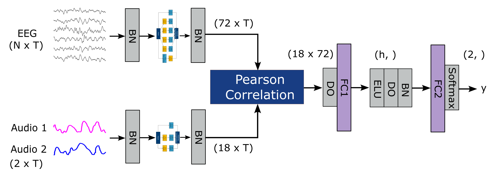

# AADNet: An End-to-End Deep Learning Model for Auditory Attention
This is source code for AADNet described in the study __AADNet: An End-to-End Deep Learning Model for Auditory Attention.__ This also includes the implementation of the other baseline methods of AAD algorithms used in this study, including the linear stimulus reconstruction (LSR), Canonical Correlation Analysis (CCA), and the non-linear stimulus reconstruction (NSR) methods. It is important to note that the implementation of NSR method from [Thornton et al.](https://iopscience.iop.org/article/10.1088/1741-2552/ac7976) (the EEGNetAAD model in aadnet/EnvelopeAAD.py file) is integrated from [the original implementation](https://github.com/Mike-boop/mldecoders). Please note that this implementation is not optimized for memory usage. Readers are welcome to re-implement all methods.

This repo contains:

Environment:
-------------

How to use:
-------------

License
-------------
CC-BY-NC-4.0
